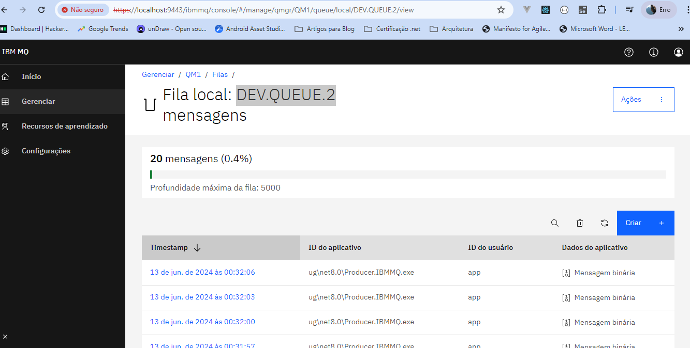

# O que é esta poc?
Esta poc tem por objetivo, conceitualizar o padrão publish subscriber implementado para o IbmMq.

## Como executar a POC?

1 - Instale o docker em sua máquina, após instalado, certifique-se que o deamon do docker esteja rodando.

2 - Abra o seu terminal e rode os seguintes comandos.
```code
docker pull icr.io/ibm-messaging/mq:latest

docker volume create qm1data

docker run --env LICENSE=accept --env MQ_QMGR_NAME=QM1 --volume qm1data:/mnt/mqm --publish 1414:1414 --publish 9443:9443 --detach --env MQ_APP_PASSWORD=passw0rd --env MQ_ADMIN_PASSWORD=passw0rd --name QM1 icr.io/ibm-messaging/mq:latest
````

3 - Abra o seu navegador e digite o seguinte endereço:
[https://localhost:9443/ibmmq/console](https://localhost:9443/ibmmq/console)

4 - Entre com o usuário [admin] e a senha [passw0rd].

5 - Procure pela fila DEV.QUEUE.2 conforme imagem abaixo.



6 - Rode o projeto Producer.IBMMQ e veja no console as mensagens chegando na fila. 
Este projeto implementa o padrão **PUBLISHER**.

7 - Rode o projeto Consumer.IBMMQ e veja como as mensagens são lidas da fila.
Este projeto implementa o padrão **SUBSCRIBER**.

